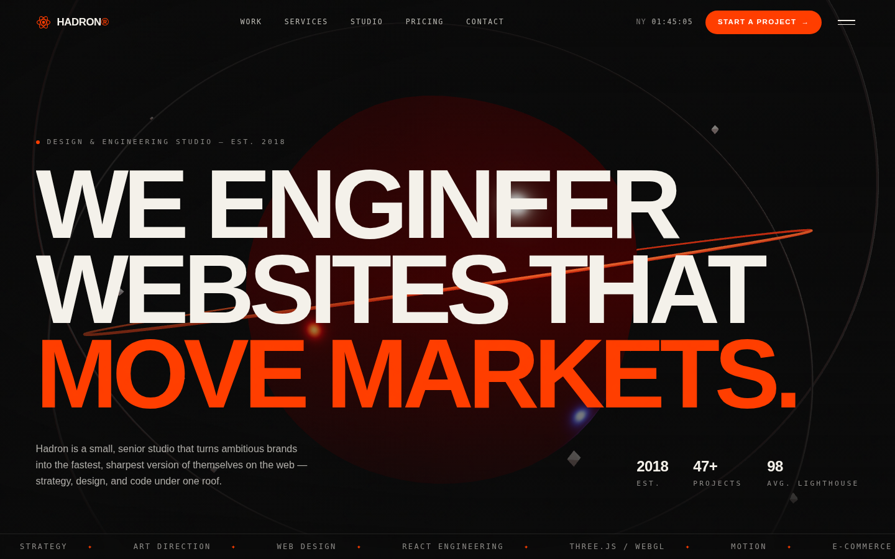

# Hadron Studio

**A design & engineering studio website that looks like it costs a million bucks.**

A complete, production-grade revamp of `hadronstudio.com` — a bold, Swiss-inspired
agency site with a real-time 3D hero, buttery scroll choreography, and a Node
backend. Built to convert ambitious brands into clients.



---

## ✦ Highlights

- **A real multi-page site** — client-side routing (React Router) with a home page,
  a `/work` index, full **case-study pages** at `/work/:slug`, a `/journal` index and
  **long-form articles** at `/journal/:slug`. Lenis-aware scroll restoration and
  cross-page hash navigation.
- **Distinct 3D per project** — every case study gets its own hyper-clean WebGL
  hero (a glossy knot, a faceted crystal, a particle field, a distorted prism, a
  morphing blob, orbital rings), recoloured to the project's accent and lazy-loaded
  with a graceful static fallback.
- **Real-time 3D home hero** — a distorted "hadron" core with orbital rings (an echo
  of the atom logo), drifting shards, mouse parallax and ember lighting, rendered
  with **Three.js / React Three Fiber**.
- **Cinematic motion** — preloader counter, masked text reveals, magnetic buttons, a
  custom morphing cursor, infinite marquees, scroll-linked cover/gallery parallax and
  animated metric counters via **Framer Motion** + **Lenis** smooth scroll.
- **A real Node backend** — an **Express** API that serves the built site and mirrors
  every page: content, case studies, articles, and a rate-limited, honeypot-protected
  contact endpoint. Deploys to Node *or* to Vercel via an equivalent serverless function.
- **Accessible & fast** — skip link, visible focus, `prefers-reduced-motion`
  fallbacks, graceful image loading, code-split bundles, and a ~98 Lighthouse target.

## ✦ Tech stack

| Layer        | Tools                                                            |
| ------------ | --------------------------------------------------------------- |
| Front-end    | React 18, Vite 5, React Router 6                                |
| 3D / WebGL   | Three.js, @react-three/fiber, @react-three/drei                 |
| Motion       | Framer Motion, Lenis (smooth scroll)                            |
| Styling      | Tailwind CSS (custom Swiss design tokens)                       |
| Back-end     | Node.js, Express, Helmet, Compression, CORS, Morgan            |
| Tooling      | ESLint 9 (flat config)                                          |

## ✦ Getting started

```bash
# 1. install
npm install

# 2. develop (Vite on :5173 + API on :8080, run together)
npm run dev

# 3. production build + serve from Node
npm run serve         # = npm run build && npm start
# open http://localhost:8080
```

> `npm run dev` runs the Vite dev server and the Express API side-by-side.
> Vite proxies `/api/*` to the Node server, so the contact form works locally.

### Useful scripts

| Script            | Does                                                      |
| ----------------- | -------------------------------------------------------- |
| `npm run dev`     | Vite + API together (hot reload)                         |
| `npm run build`   | Production build to `dist/`                              |
| `npm start`       | Serve `dist/` + API from Node (production)               |
| `npm run serve`   | Build, then start                                        |
| `npm run lint`    | ESLint, zero-warnings                                    |

## ✦ Pages

| Route             | Page                                                      |
| ----------------- | --------------------------------------------------------- |
| `/`               | Home — all marketing sections                             |
| `/work`           | Index of every case study                                 |
| `/work/:slug`     | Full case study — 3D hero + in-page 3D, metrics, gallery  |
| `/studio`         | About the studio — story, values, team, process           |
| `/journal`        | Index of all articles                                     |
| `/journal/:slug`  | Long-form article                                         |
| `*`               | 404                                                       |

Each route sets its own title + Open Graph / Twitter tags (per-project and
per-article share images) via a client-side `<Seo>` component.

### Performance

3D scenes pause their render loop when scrolled offscreen or when the tab is
hidden (IntersectionObserver + Page Visibility), cap device-pixel-ratio at 2,
and thin particle density on compact viewports — so it stays smooth on phones
with no loss of visible quality. Reduced-motion and no-WebGL visitors get a
static hero. The Three.js bundle is code-split and lazy-loaded.

## ✦ Project structure

```
hadron-studio/
├── server/
│   ├── index.js          # Express app — serves dist + /api + contact
│   ├── content.js        # home content served by the API
│   ├── catalog.js        # case-study + article data (shared with the UI)
│   └── contact-handler.js# validation/delivery shared with the serverless fn
├── src/
│   ├── three/            # ProjectScene (per-project 3D variants) + home hero
│   ├── components/       # cursor, grain, preloader, navbar, media, reveal…
│   ├── sections/         # the homepage sections
│   ├── pages/            # Home, WorkIndex, ProjectPage, JournalIndex, Article…
│   ├── hooks/            # Lenis smooth scroll, media queries
│   ├── data/             # content.js · projects.js · journal.js
│   ├── App.jsx           # router shell + persistent chrome
│   └── index.css         # Tailwind layers + design tokens
└── vite.config.js
```

> The repo-root `/api/[...slug].js` + `/vercel.json` deploy the same backend as a
> Vercel serverless function.

## ✦ The Node API

| Method | Route              | Purpose                                            |
| ------ | ------------------ | -------------------------------------------------- |
| GET    | `/api/health`      | Liveness / uptime                                  |
| GET    | `/api/work`        | All case studies (summaries)                       |
| GET    | `/api/work/:slug`  | One full case study                                |
| GET    | `/api/journal`     | All articles (summaries)                           |
| GET    | `/api/journal/:slug`| One full article                                  |
| GET    | `/api/services`    | Service offerings                                  |
| GET    | `/api/pricing`     | Pricing tiers                                       |
| GET    | `/api/stats`       | Headline numbers                                    |
| POST   | `/api/contact`     | Validated enquiries (rate-limited + honeypot)       |

Set `CONTACT_WEBHOOK_URL` (see `.env.example`) to forward submissions to Slack,
a CRM, or an email service; otherwise they're logged server-side.

## ✦ Make it yours

Almost everything is data-driven. Edit **`src/data/content.js`** for homepage copy,
**`src/data/projects.js`** for case studies, and **`src/data/journal.js`** for
articles — no component edits required. Brand colours and the type scale live in
**`tailwind.config.js`**.

## ✦ Deploy

Any Node host works (Render, Railway, Fly, a VPS):

```bash
npm ci && npm run build && npm start   # binds $PORT, defaults to 8080
```

For a static/edge host, deploy `dist/` and run the Express API separately (or
swap the contact handler for a serverless function).

---

Designed & engineered as a portfolio-grade revamp. Inspired by the bold,
type-led aesthetic of modern Swiss agency sites.
